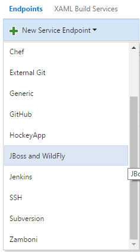
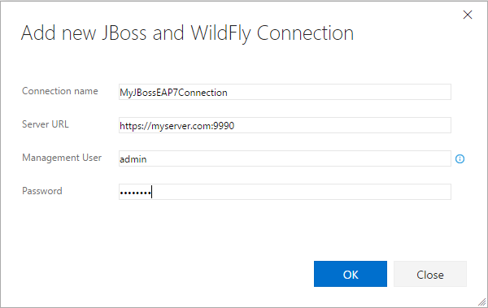
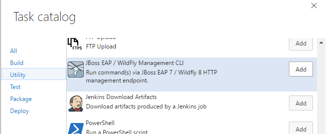
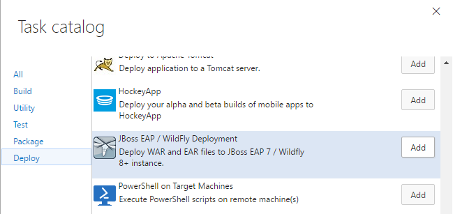

This extension provides build tasks to manage and deploy WAR and EAR file to JBoss Enterprise Application Platform (EAP) 7 or WildFly 8 and above.

This extension installs the following components:
* A service endpoint for connecting to JBoss EAP 7 and WildFly 8 and above.
* A build task to run commands over HTTP management endpoint.
* A build task to deploy your WAR and EAR files to JBoss EAP 7 and WildFly 8 and above.

## Create a JBoss EAP / WildFly Connection
* Make sure the application server's management http interface is exposed and can be reached over the network.
* Skip this step if you are on Team Foundation Server 2015 and enter the credentials directly on the task.

1. Open the Services page in your Visual Studio Team Services Control Panel
1. In the New Service Endpoint list, choose "JBoss and WildFly"

   

1. Create a "JBoss and WildFly" Service Endpoint and specify your JBoss EAP 7 or WildFly 8+ management URL, username and password.

   

## Manage JBoss and WildFly servers over http

1. Open your build definition and add the "JBoss EAP / WildFly Management CLI" task. The task can be found in the "Utility" section.

    
  
1. Select the "JBoss and WildFly" service endpoint you created previously, or enter the credentials.
1. Enter commands to be executed, one command per line.

## Deploy applications to JBoss EAP 7 and WildFly 8 and above

1. Open your build definition and add the "JBoss EAP / WildFly Deployer CLI" task. The task can be found in the "Utility" section.

   

1. Select the "JBoss and WildFly" service endpoint you created previously, or enter the credentials.
1. Enter the file to be deployed (a wildcard is allowed but it must resolve to exactly one file).
1. Select and enter other optional fields.  Hover over the info icon at the end of each field for additional help.

## Learn more
For detailed instructions on setting up a build or release pipeline, check out [this guide](https://docs.microsoft.com/vsts/build-release/actions/ci-cd-part-1).

Check out [this guide](https://docs.microsoft.com/vsts/extend/overview) for an overview of extensions of Visual Studio Team Services.

For detailed instructions on how to get and install extensions, check out [this guide](https://docs.microsoft.com/vsts/marketplace/overview)

## Create a WildFly instance on Azure
Microsoft Azure provides pre-configured [WildFly](https://azuremarketplace.microsoft.com/marketplace/apps/category/compute?search=wildfly) images. Create your free [Azure account](https://azure.microsoft.com/en-us/free/) if you do not have an Azure account.

## License
The [code](https://github.com/Microsoft/vsts-jboss-wildfly) is open sourced under the MIT license. We love and encourage community contributions.
