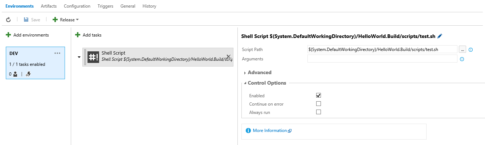
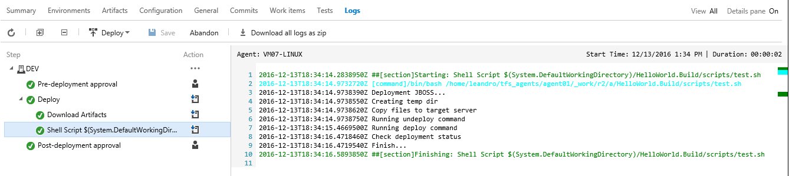
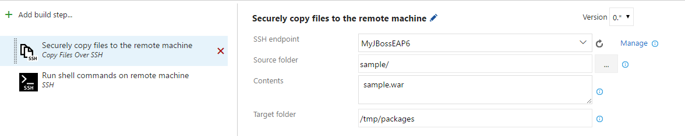
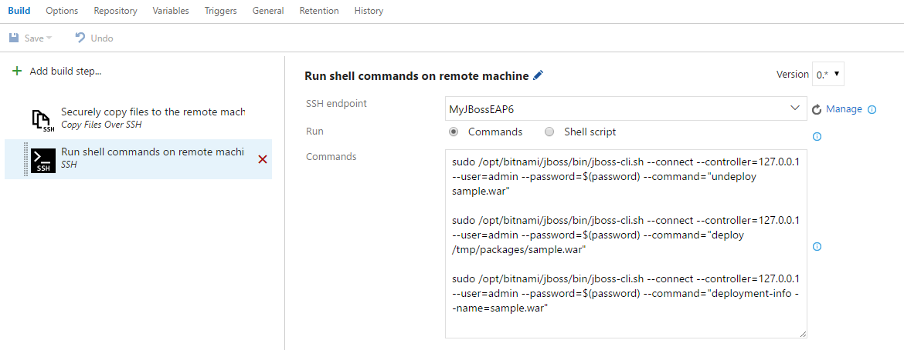
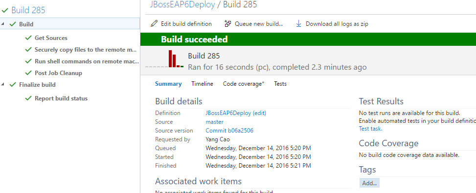

# Deploy applications to JBoss EAP 6
There are two options to deploy WAR and EAR file to JBoss Enterprise Application Platform (EAP) 6:
  1. You can invoke a shell script on a Linux build agent to scp the application to the server, and then deploy with JBoss Command Line Interface (CLI);
  1. Or you can use [SSH](https://www.visualstudio.com/en-us/docs/build/steps/deploy/ssh) and [Copy Files Over SSH](https://www.visualstudio.com/en-us/docs/build/steps/deploy/copy-files-over-ssh) tasks to accomplish this task.

## Deploying from Linux build agent
### Prereqs 
  1. JBoss 6 EAP installed and configured
  1. Linux machine with cross platform build agent for Team Foundation Server. For detailed instructions [check this guide](https://github.com/Microsoft/vsts-agent/blob/master/docs/start/envubuntu.md) 
  1. SSH and SSH Pass configured

### Example SSH Script
The example bellow use SSH connection to connect in target machine and execute the JBoss CLI commands.
The steps required are:

  1. Create temp directory
  1. Copy files (Artifact) to temp directory
  1. Running `jboss-cli.sh` to undeploy old version
  1. Running `jboss-cli.sh` to deploy new version of WAR file
  1. Runnig `jboss-cli.sh` for check deployment status

```
!/bin/bash
echo "Deployment JBOSS..."

PACKAGETEMP=/tmp/package

echo "Creating temp dir"
sshpass -p P@ssw0rd ssh root@127.0.0.1 'mkdir -v $PACKAGETEMP'

echo "Copy files to target server"
sshpass -p P@ssw0rd scp -r -v $AGENT_RELEASEDIRECTORY/JavaBuild/Drop root@127.0.0.1:$PACKAGETEMP/hello.war

echo "Running undeploy command"
sshpass -p P@ssw0rd ssh root@127.0.0.1 '/opt/EAP-6.0.1/jboss-eap-6.0/bin/jboss-cli.sh --connect --controller=127.0.0.1 --user=admin --password=P@ssw0rd --command="undeploy hello.war --server-groups=HelloWorld"'

echo "Running deploy command"
sshpass -p P@ssw0rd ssh root@127.0.0.1 '/opt/EAP-6.0.1/jboss-eap-6.0/bin/jboss-cli.sh --connect --controller=127.0.0.1 --user=admin --password=P@ssw0rd --command="deploy $PACKAGETEMP/hello.war --server-groups=HelloWorld"'

echo "Check deployment status"
sshpass -p P@ssw0rd ssh root@127.0.0.1 '/opt/EAP-6.0.1/jboss-eap-6.0/bin/jboss-cli.sh --connect --controller=127.0.0.1 --user=admin --password=P@ssw0rd --command="deployment-info --name=hello.war"'
```

Add the shell script in source control, or share folder.

### Configure Team Foundation Server

Create new release definition add add the task [Shell script](https://www.visualstudio.com/en-us/docs/build/steps/utility/shell-script) and enter the path for shell script

Check the configuration bellow:

  

Running new release and check the log events

  


## Deploy using built-in SSH and Copy Files Over SSH tasks
### Prereqs
  1. JBoss 6 EAP installed and configured
  1. Create a SSH service connection endpoint with credentials that has permission to run `jboss-cli.sh` script

### Configure Copy Files Over SSH task
  
  1. Select the predefined SSH endpoint.
  1. Copy the application file to the remote server

### Configure SSH task
  
  1. You can define any secret variables, such as the password, in the `variables` tab, and reference it in the script.

Running the definition and check log events:
  
  

## Learn more
To learn more about JBoss EAP 6 CLI commands, please check [this guide](https://access.redhat.com/documentation/en-US/JBoss_Enterprise_Application_Platform/6.1/html/Administration_and_Configuration_Guide/sect-The_Management_CLI.html#About_the_Management_Command_Line_Interface_CLI).

For detailed instructions on setting up a release definition, check out [this guide](https://www.visualstudio.com/en-us/docs/release/author-release-definition/more-release-definition).

Check out [this guide](https://www.visualstudio.com/en-us/docs/integrate/extensions/overview) for an overview of extensions of Visual Studio Team Services.

For detailed instructions on how to get and install extensions, check out [this guide](https://www.visualstudio.com/en-us/docs/marketplace/overview)
